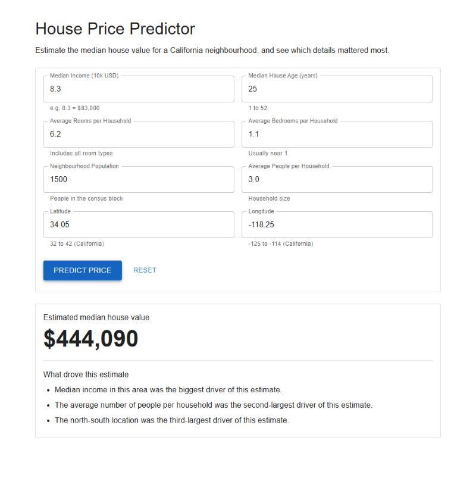
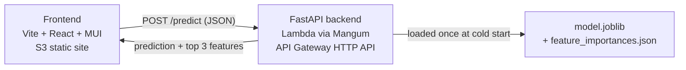

# House Price Predictor

Predicts the median house value of a California neighbourhood from eight
numbers, and tells you in plain English which of them mattered most.

**[Try it live](http://house-price-predictor-site-228755391818.s3-website-us-east-1.amazonaws.com)** ·
[API](https://0797zb9403.execute-api.us-east-1.amazonaws.com/health) ·
Python · FastAPI · scikit-learn · React · AWS Lambda



---

## What it does

You enter eight features of a California census block group — median income,
house age, average rooms, average bedrooms, population, average occupancy,
latitude and longitude. A `RandomForestRegressor` trained on the California
Housing dataset returns a predicted median house value, along with the three
features that contribute most to the model's decisions, phrased as sentences
rather than variable names.

It is deliberately small: one dataset, one model, no database, no accounts.
The goal was a finished, deployed, explainable product rather than a maximal
feature set.

## Live

| | |
|---|---|
| **Web app** | http://house-price-predictor-site-228755391818.s3-website-us-east-1.amazonaws.com |
| **API** | https://0797zb9403.execute-api.us-east-1.amazonaws.com |
| **Health check** | [`/health`](https://0797zb9403.execute-api.us-east-1.amazonaws.com/health) |

The first request after a period of inactivity takes a few seconds — Lambda
has to cold-start and unpickle a 32 MB model. Subsequent requests are ~10 ms.

## Results

Trained on an 80/20 split of the 20,640-row California Housing dataset.

| Metric | Value |
|---|---|
| R² (held-out test set) | **0.805** |
| MAE | **0.328** — about **$32,800** |

The target is median house value in units of $100,000, so an MAE of 0.328
means predictions are off by roughly $33k on average.

## Architecture



The model is trained **offline** by `backend/train.py`, which writes
`model.joblib` and `feature_importances.json`. The API loads both once at
import time and serves predictions from memory — no retraining, no database,
no disk I/O in the request path.

## Why RandomForestRegressor

Three reasons, in order of how much they actually mattered:

**Explainability without extra machinery.** The whole point of the app is
saying *why* a prediction came out the way it did. Random forests expose
`.feature_importances_` directly, so the explanation falls out of the model
rather than requiring SHAP or LIME as an extra dependency and an extra
concept to justify.

**No preprocessing needed.** Tree-based models split on raw values, so they
don't care about feature scaling. All eight features are numeric with wildly
different ranges — income in tens of thousands, population in thousands,
latitude in degrees — and a linear model or an SVM would have needed a
`StandardScaler` in a pipeline, plus the discipline to apply the same
transform at inference time. Trees skip that class of bug entirely.

**It handles non-linearity that a linear model can't.** House value against
latitude/longitude is not linear — it's geographic, with expensive coastal
pockets. Linear regression underfits that badly. A forest captures it by
splitting on location repeatedly.

**What I'd have used instead, and why I didn't:** gradient boosting
(`HistGradientBoostingRegressor`) would likely score a point or two higher on
R², but it adds hyperparameter sensitivity and is harder to reason about out
loud. For a project whose purpose is explaining the model, a single forest I
can describe completely beat a marginally more accurate one I couldn't.

## What the feature importances mean

`feature_importances_` in scikit-learn is **mean decrease in impurity**: for
each feature, how much it reduced variance across all the splits that used
it, averaged over all 100 trees, normalised to sum to 1.

| Feature | Importance | Plain English |
|---|---|---|
| `MedInc` | 0.525 | Median income in the area |
| `AveOccup` | 0.138 | Average people per household |
| `Latitude` | 0.089 | North–south location |
| `Longitude` | 0.088 | East–west location |
| `HouseAge` | 0.055 | Age of homes |
| `AveRooms` | 0.044 | Average rooms per home |
| `Population` | 0.031 | Local population |
| `AveBedrms` | 0.030 | Average bedrooms per home |

Median income alone accounts for over half the model's decisions, and the two
geographic features together account for another ~18% — which matches the
intuition that in California, *what you earn* and *where you are* dominate.

The UI surfaces the top three of these as sentences under the predicted
price, mapping each variable name to plain English — `MedInc` becomes
"Median income in this area was the biggest driver of this estimate."

**Two honest caveats, worth knowing before an interview:**

1. **These are global, not per-prediction.** The API reports the same top 3
   for every request, because they describe the *model*, not the individual
   estimate. True per-prediction attribution needs SHAP, which was scoped out
   of v1. The UI wording ("was the biggest driver of this estimate") is
   therefore a slight simplification.
2. **Impurity-based importance is biased toward high-cardinality features.**
   Continuous variables offer more possible split points than coarse ones, so
   they tend to score higher. Permutation importance avoids this bias and
   would be the more rigorous choice.

Note also that `Latitude` (0.0890) and `Longitude` (0.0885) are separated by
0.0005 — effectively tied. Which one lands in the top 3 is arbitrary and
would flip with a different `random_state`.

## Running locally

Requires Python 3.13+ and Node 20+.

**Backend**

```bash
cd backend
python -m venv venv
venv\Scripts\activate
pip install -r requirements.txt
python train.py
uvicorn app.main:app --reload
```

On macOS or Linux, activate with `source venv/bin/activate` instead.

The API is then at `http://127.0.0.1:8000`, with interactive docs at
`http://127.0.0.1:8000/docs`. `train.py` takes about a minute and must be run
once before starting the API — the app loads the model artifact at import and
will fail without it.

**Frontend**

```bash
cd frontend
npm install
npm run dev
```

Opens at `http://localhost:5173`. `.env.development` already points it at the
local backend; `.env.production` points at the deployed API.

## Tests

```bash
cd backend
pytest
```

19 tests, covering three layers:

- `test_model.py` — the saved artifact loads, predicts one value per row in
  the valid target range, takes 8 features, and the importances cover all
  eight and sum to 1
- `test_api.py` — `/health`, a well-formed `/predict` response, internal
  consistency between the dollar and $100k figures, and 422s for missing,
  out-of-range and non-numeric input
- `test_lambda.py` — the Mangum handler answers real API Gateway HTTP API v2
  event payloads, so the Lambda entry point is verified without deploying

Frontend testing is manual, per the project plan's scoping.

## API

**`POST /predict`**

```json
{
  "MedInc": 8.3, "HouseAge": 25, "AveRooms": 6.2, "AveBedrms": 1.1,
  "Population": 1500, "AveOccup": 3.0, "Latitude": 34.05, "Longitude": -118.25
}
```

```json
{
  "predicted_value": 4.4409,
  "predicted_value_usd": 444090,
  "top_features": [
    {"feature": "MedInc", "importance": 0.525},
    {"feature": "AveOccup", "importance": 0.1384},
    {"feature": "Latitude", "importance": 0.089}
  ]
}
```

All eight fields are required and range-validated against the training data's
actual bounds. Invalid input returns `422` naming the offending field.

**`GET /health`** returns `{"status": "ok"}`.

## Deployment

```bash
cd backend
python build_lambda.py
aws s3 cp dist/lambda.zip s3://house-price-predictor-artifacts-228755391818/lambda.zip
aws lambda update-function-code --function-name house-price-predictor-api --s3-bucket house-price-predictor-artifacts-228755391818 --s3-key lambda.zip
```

```bash
cd frontend
npm run build
aws s3 sync dist s3://house-price-predictor-site-228755391818 --delete
```

`build_lambda.py` downloads Linux wheels, strips test suites, bytecode and
packaging metadata, and zips the result — 213.5 MB unzipped against Lambda's
250 MB ceiling. It runs on Windows without Docker.

**Two packaging details that were not obvious:**

- **pandas had to go.** The API used it only to wrap a single row for
  `.predict()`, at a cost of ~34 MB. It's a numpy array now, and the model is
  fit on arrays too so scikit-learn doesn't warn about absent feature names on
  every call.
- **The platform tag matters.** The build passes *both* `manylinux_2_28` and
  `manylinux_2_17`, because scikit-learn 1.9.0 publishes only the former and
  pydantic-core only the latter. With `manylinux2014` alone, pip silently
  resolves scikit-learn down to 1.7.2 — which cannot load this model artifact.
  That failure would only have appeared in production.

## Known limitations

- **Predictions saturate near $500,000.** The California Housing target is
  clipped at $500,001 in the source data, so the model cannot predict above
  5.0 no matter the input. This is a property of the 1990 census dataset, not
  a bug.
- **The data is from 1990.** Absolute values are decades out of date; the
  model demonstrates the method, not current market prices.
- **The site is served over HTTP.** S3 static website hosting can't do HTTPS
  without CloudFront, which was scoped out of v1.
- **No auth or rate limiting.** The API is public and unauthenticated.

## Project structure

```
backend/
  app/main.py              FastAPI app, Pydantic schemas, Mangum handler
  train.py                 Offline training -> model artifacts
  build_lambda.py          Linux deployment package builder
  model/                   model.joblib + feature_importances.json
  tests/                   19 pytest tests
  requirements.txt         Local dev (includes pytest, uvicorn)
  requirements-lambda.txt  Runtime only, pinned to training versions
frontend/
  src/App.jsx              Single-screen form + result card
  .env.development         Points at local backend
  .env.production          Points at deployed API
```

## Tech stack

| Layer | Choice |
|---|---|
| Backend | FastAPI, Python 3.13 |
| ML | scikit-learn `RandomForestRegressor` |
| Serialization | joblib |
| Frontend | Vite + React 19 + MUI |
| Tests | pytest |
| Backend hosting | AWS Lambda + API Gateway (HTTP API) via Mangum |
| Frontend hosting | AWS S3 static website |
